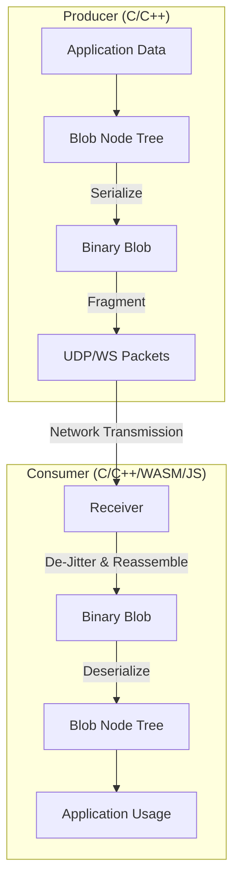

# Blob Library

A lightweight, high-performance C library for serializing, transmitting, and reconstructing hierarchical data structures ("blobs") over varied transport layers (UDP, WebSocket, etc.). It is designed for real-time telemetry and control in embedded systems and high-throughput web applications.

## Architecture

The Blob library is built on a layered architecture that separates data structure management from serialization and transport.

### Core Components

1.  **Blob Node Tree (`blob_node.h`)**:
    *   Represents data as a hierarchical tree of nodes.
    *   Each node can contain primitive data arrays (int, float, uint) and child nodes.
    *   Supports dynamic construction and traversal.

2.  **Serialization/Core (`blob_core.h`)**:
    *   Handles the flattening of the node tree into a compact binary format.
    *   Handles reconstruction of the tree from binary data.
    *   optimized for minimal overhead.

3.  **Jitter Buffer (`blob_jbuf_frag.h`)**:
    *   Manages packet reordering, de-duplication, and frame assembly.
    *   Critical for ensuring data integrity over unreliable transport protocols like UDP.

4.  **Transport Layers**:
    *   **UDP (`blob_udp.h`)**: Fast, connectionless transmission. Used for high-frequency telemetry.
    *   **WebSocket (`blob_ws_win.c` / `blob_wasm.c`)**: Reliable, full-duplex communication for web clients.
    *   **Frag/Defrag**: Handles splitting large blobs into MTU-sized chunks and reassembling them.

### Data Flow Diagram



## Supported Backends & Platforms

The library is designed to be portable and supports multiple backends:

| Backend | Purpose | Status |
| :--- | :--- | :--- |
| **C (Window/Linux)** | Core library, Desktop Clients, Embedded Systems | ✅ Production Ready |
| **WASM (Emscripten)** | High-performance Browser Decoding | ✅ Integrated |
| **JavaScript (Legacy)** | Legacy Browser Decoding (slower) | ⚠️ Maintenance Mode |
| **Python** | Analysis & Scripting (via CFFI/ctypes) | ✅ Experimental |

## integration & Testing Matrix

We ensure stability through a comprehensive suite of automated tests. Run `python run_all_tests.py` to execute the full suite.

| Test Suite | Description | Components Tested |
| :--- | :--- | :--- |
| **Unit Tests** (`blob_unit_test`) | Verifies core serialization, node manipulation, and jitter buffer logic. | `blob_core`, `blob_node`, `blob_jbuf` |
| **Loopback Test** (`blob_loopback_test`) | End-to-End test sending data from C -> Server -> C (WebSocket). Verifies transport and header handling. | `blob_ws`, `blob_server`, `IP Headers` |
| **Triangle Test** (`blob_triangle_test`) | Simulation of a triangular data generator and receiver to verify signal integrity. | `blob_udp`, Fragmentation |
| **Network Test** (`blob_network_test`) | Basic UDP connectivity and packet loss resilience. | `blob_udp` |
| **JS/WASM Tests** | Verifies browser-side decoding logic (Unit tests via Jest/Mocha). | `blob.js`, `blob_wasm` |

## WebAssembly (WASM) Integration

The WASM module (`blob_wasm.c`) provides a high-performance alternative to the JavaScript decoder. It allows the browser to:
1.  Receive raw UDP/WebSocket packets directly.
2.  Pass them into a C-based Jitter Buffer compiled to WASM.
3.  Reassemble fragments and decode the Blob Node Tree in WASM memory.
4.  Expose the structured data to JavaScript via a zero-copy (or minimal-copy) API.

### Build WASM
To build the WASM module, ensure Emscripten is active and run:
```bash
cd wasm
./build.ps1
```

## Directory Structure

*   `src/`: Core C source files.
*   `include/`: Public API headers.
*   `test/`: C unit and integration tests.
*   `wasm/`: Source and build scripts for the WebAssembly module.
*   `js/`: legacy JavaScript implementation.
*   `python_examples/`: Python bindings and examples.

## Usage Examples

### C (Producing Data)

```c
#include "blob.h"

int main() {
    // 1. Initialize
    blob_comm_cfg cfg = { .p_send_cb = my_send_callback, .p_send_context = ctx };
    blob *p_blob = NULL;
    blob_init(&p_blob, &cfg);
    
    // 2. Start a Node
    blob_start(p_blob, "sensor_data");
    
    // 3. Add Data
    float temperature[] = { 23.5f, 24.1f };
    int status[] = { 1, 0 };
    blob_float_a(p_blob, "temp", temperature, 2);
    blob_int_a(p_blob, "status", status, 2);
    
    // 4. Flush (Serialize & Send)
    blob_flush(p_blob);
    
    // 5. Cleanup
    blob_close(&p_blob);
    return 0;
}
```

### Python (Sending Data)

```python
import numpy as np
import blob.blob_write as bw
import blob.blob_udp as bu

# 1. Initialize Writer & Transport
writer = bw.BlobWriter('sensor_data', ['temp', 'status'])
udp_tx = bu.BlobUDPTx('127.0.0.1', port=3456)

# 2. Update Data
writer.temp = np.array([23.5, 24.1], dtype=np.float32)
writer.status = np.array([1, 0], dtype=np.int32)

# 3. Serialize & Send
data = writer.flush()
udp_tx.send(data)
```

### C (Consuming Data)

```c
#include "blob.h"

// Callback to receive data from transport (e.g., UDP/WS)
int my_rcv_callback(void *context, unsigned char **pp_data, size_t *p_size) {
    // 1. Retrieve data from your transport layer
    *pp_data = my_transport_buffer;
    *p_size = my_transport_bytes;
    return 0;
}

int main() {
    // 1. Initialize
    blob_comm_cfg cfg = { .p_rcv_cb = my_rcv_callback, .p_rcv_context = ctx };
    blob *p_blob = NULL;
    blob_init(&p_blob, &cfg);
    
    // 2. Decode & Process
    if (blob_retrieve_start(p_blob, "sensor_data") == BLOB_OK) {
        float *temps;
        int n_temps;
        
        // 3. Extract Variables
        blob_retrieve_float_a(p_blob, "temp", &temps, &n_temps, 0);
        
        for(int i=0; i<n_temps; i++) {
            printf("Temp[%d]: %f\n", i, temps[i]);
        }
    }
    
    blob_close(&p_blob);
    return 0;
}
```

### Python (Consuming Data)

```python
from blob.blob_read import blob_read_node_tree, blob_minimal, blob_flatten

# 1. Receive binary data (e.g., from UDP socket)
data, addr = sock.recvfrom(4096)

# 2. Parse the binary blob
# blob_read.py provides a pure Python implementation - no C compilation needed!
node_tree, remains = blob_read_node_tree(data)

# 3. Access Data
# You can navigate the tree directly or flatten it for easier access
flat_data = blob_flatten(blob_minimal(node_tree))

print(f"Temp: {flat_data['sensor_data.temp']}")
print(f"Status: {flat_data['sensor_data.status']}")
```

### JavaScript / WASM (Consuming Data)

```javascript
// 1. Initialize Decoder
import { initBlobWasm, decodeBlob } from './blob_wasm_integration.js';
await initBlobWasm();

// 2. Receive & Decode (e.g. from WebSocket)
ws.onmessage = (event) => {
    // decodeBlob handles WASM memory allocation, jitter buffering, and decoding
    const nodes = decodeBlob(event.data);
    
    nodes.forEach(node => {
        console.log(`Node: ${node.nodename}`);
        console.log('Temp:', node.data.temp);
        console.log('Status:', node.data.status);
    });
};
```
