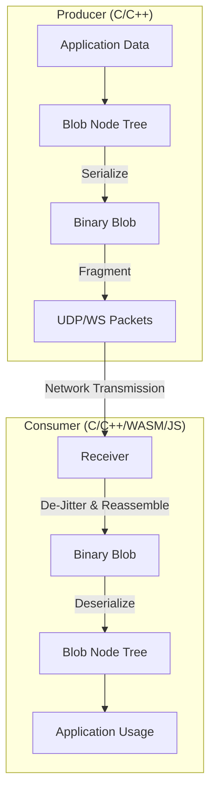

# Blob Library

A lightweight, high-performance C library for serializing, transmitting, and reconstructing hierarchical data structures ("blobs") over varied transport layers (UDP, WebSocket, etc.). It is designed for real-time telemetry and control in embedded systems and high-throughput web applications.

## Architecture

The Blob library is built on a layered architecture that separates data structure management from serialization and transport.

### Core Components

1.  **Blob Node Tree (`blob_node.h`)**:
    *   Represents data as a hierarchical tree of nodes.
    *   Each node can contain primitive data arrays (int, float, uint) and child nodes.
    *   Supports dynamic construction and traversal.

2.  **Serialization/Core (`blob_core.h`)**:
    *   Handles the flattening of the node tree into a compact binary format.
    *   Handles reconstruction of the tree from binary data.
    *   optimized for minimal overhead.

3.  **Jitter Buffer (`blob_jbuf_frag.h`)**:
    *   Manages packet reordering, de-duplication, and frame assembly.
    *   Critical for ensuring data integrity over unreliable transport protocols like UDP.

4.  **Transport Layers**:
    *   **UDP (`blob_udp.h`)**: Fast, connectionless transmission. Used for high-frequency telemetry.
    *   **WebSocket (`blob_ws_win.c` / `blob_wasm.c`)**: Reliable, full-duplex communication for web clients.
    *   **Frag/Defrag**: Handles splitting large blobs into MTU-sized chunks and reassembling them.

### Data Flow Diagram



## Supported Backends & Platforms

The library is designed to be portable and supports multiple backends:

| Backend | Purpose | Status |
| :--- | :--- | :--- |
| **C (Window/Linux)** | Core library, Desktop Clients, Embedded Systems | ✅ Production Ready |
| **WASM (Emscripten)** | High-performance Browser Decoding | ✅ Integrated |
| **JavaScript (Legacy)** | Legacy Browser Decoding (slower) | ⚠️ Maintenance Mode |
| **Python** | Analysis & Scripting (via CFFI/ctypes) | ✅ Experimental |

## integration & Testing Matrix

We ensure stability through a comprehensive suite of automated tests. Run `python run_all_tests.py` to execute the full suite.

| Test Suite | Description | Components Tested |
| :--- | :--- | :--- |
| **Unit Tests** (`blob_unit_test`) | Verifies core serialization, node manipulation, and jitter buffer logic. | `blob_core`, `blob_node`, `blob_jbuf` |
| **Loopback Test** (`blob_loopback_test`) | End-to-End test sending data from C -> Server -> C (WebSocket). Verifies transport and header handling. | `blob_ws`, `blob_server`, `IP Headers` |
| **Triangle Test** (`blob_triangle_test`) | Simulation of a triangular data generator and receiver to verify signal integrity. | `blob_udp`, Fragmentation |
| **Network Test** (`blob_network_test`) | Basic UDP connectivity and packet loss resilience. | `blob_udp` |
| **JS/WASM Tests** | Verifies browser-side decoding logic (Unit tests via Jest/Mocha). | `blob.js`, `blob_wasm` |

## WebAssembly (WASM) Integration

The WASM module (`blob_wasm.c`) provides a high-performance alternative to the JavaScript decoder. It allows the browser to:
1.  Receive raw UDP/WebSocket packets directly.
2.  Pass them into a C-based Jitter Buffer compiled to WASM.
3.  Reassemble fragments and decode the Blob Node Tree in WASM memory.
4.  Expose the structured data to JavaScript via a zero-copy (or minimal-copy) API.

### Build WASM
To build the WASM module, ensure Emscripten is active and run:
```bash
cd wasm
./build.ps1
```

## Directory Structure

*   `src/`: Core C source files.
*   `include/`: Public API headers.
*   `test/`: C unit and integration tests.
*   `wasm/`: Source and build scripts for the WebAssembly module.
*   `js/`: legacy JavaScript implementation.
*   `python_examples/`: Python bindings and examples.
